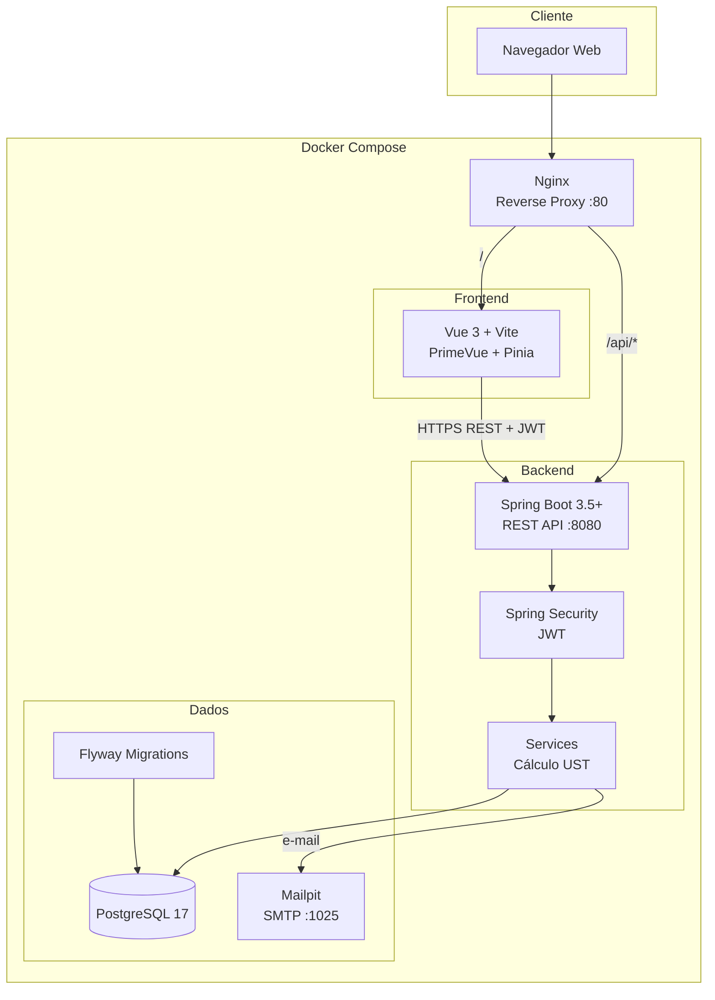
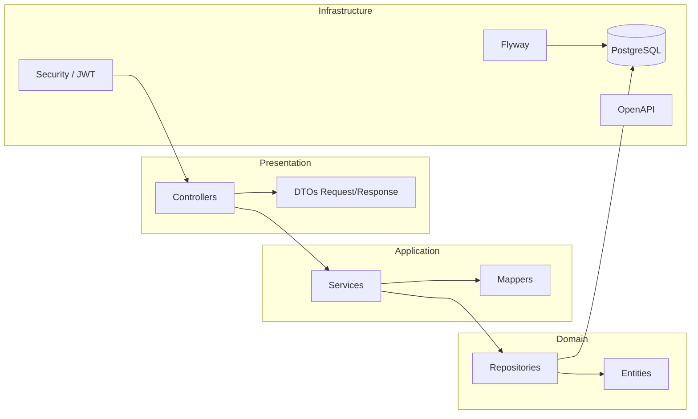
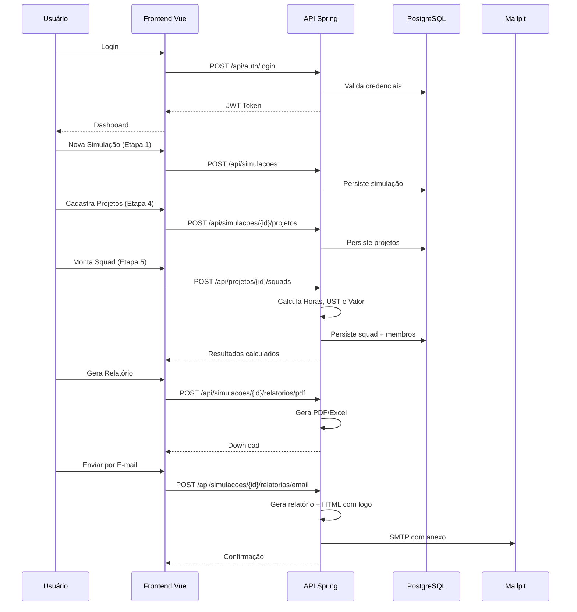

# Arquitetura — UST Gov Calculator

## Visão Geral

Sistema web para simulação de esforço e custo em **UST** (Unidade de Serviço Técnico), voltado a órgãos governamentais. Permite montagem de squads, cálculo por **FCP** (Fator de Complexidade Profissional), gestão de projetos e sustentações, com relatórios executivos e técnicos.

## Stack Tecnológica

| Camada        | Tecnologia                          |
|---------------|-------------------------------------|
| Backend       | Java 21 LTS, Spring Boot 3.5+       |
| Segurança     | Spring Security + JWT               |
| Persistência  | Spring Data JPA, Flyway             |
| API           | REST + OpenAPI / Swagger            |
| Frontend      | Vue.js 3, Vite, Pinia, Vue Router   |
| UI            | PrimeVue, Chart.js                  |
| Banco         | PostgreSQL 17                       |
| Infra         | Docker, Docker Compose, Nginx       |

## Perfis de Acesso

| Perfil        | Permissões                                                                 |
|---------------|----------------------------------------------------------------------------|
| Administrador | Configurar UST/FCP, perfis profissionais, usuários, relatórios, branding |
| Gestor        | Criar analistas, simulações, projetos, squads e relatórios                 |
| Analista      | Simulações, projetos, montagem de squads, relatórios                       |
| Consulta      | Visualização de resultados (somente leitura)                               |

## Diagrama de Arquitetura



## Diagrama de Camadas (Backend)



## Fluxo de Negócio



> Em desenvolvimento local, o frontend roda em http://localhost:5173 (Vite) e a API em http://localhost:8080. No Docker, tudo passa pelo Nginx em http://localhost.

## Fórmulas de Cálculo

```
Horas Totais = Qtd Profissionais × Horas Semanais × Semanas

UST da Squad = Horas Totais × FCP (média ponderada por perfil)

Valor Financeiro = UST × Valor UST × (1 + Encargos%) × (1 + BDI%)
```

Parâmetros configuráveis em **Configurações** (ADMIN).

## Estrutura de Pastas — Backend

```
backend/
├── src/main/java/br/gov/ust/calculator/
│   ├── UstCalculatorApplication.java
│   ├── config/
│   │   ├── SecurityConfig.java
│   │   ├── JwtConfig.java
│   │   ├── OpenApiConfig.java
│   │   └── CorsConfig.java
│   ├── controller/
│   │   ├── AuthController.java
│   │   ├── UsuarioController.java
│   │   ├── PerfilProfissionalController.java
│   │   ├── ConfiguracaoUstController.java
│   │   ├── SimulacaoController.java
│   │   ├── ProjetoController.java
│   │   ├── SquadController.java
│   │   ├── DashboardController.java
│   │   └── RelatorioController.java
│   ├── service/
│   │   ├── AuthService.java
│   │   ├── UsuarioService.java
│   │   ├── PerfilProfissionalService.java
│   │   ├── ConfiguracaoUstService.java
│   │   ├── SimulacaoService.java
│   │   ├── ProjetoService.java
│   │   ├── SquadService.java
│   │   ├── CalculoUstService.java
│   │   ├── DashboardService.java
│   │   └── RelatorioService.java
│   ├── repository/
│   ├── entity/
│   ├── dto/
│   │   ├── request/
│   │   └── response/
│   ├── mapper/
│   ├── security/
│   │   ├── JwtTokenProvider.java
│   │   ├── JwtAuthenticationFilter.java
│   │   └── UserDetailsServiceImpl.java
│   ├── exception/
│   │   ├── GlobalExceptionHandler.java
│   │   └── BusinessException.java
│   └── util/
├── src/main/resources/
│   ├── application.yml
│   ├── application-dev.yml
│   ├── application-prod.yml
│   └── db/migration/
├── src/test/java/
└── pom.xml
```

## Estrutura de Pastas — Frontend

```
frontend/
├── public/
├── src/
│   ├── assets/
│   │   └── styles/
│   ├── components/
│   │   ├── common/
│   │   │   ├── AppDataTable.vue
│   │   │   ├── AppChart.vue
│   │   │   └── ConfirmDialog.vue
│   │   └── layout/
│   │       ├── AppLayout.vue
│   │       ├── AppSidebar.vue
│   │       ├── AppTopbar.vue
│   │       └── AppFooter.vue
│   ├── views/
│   │   ├── auth/
│   │   │   └── LoginView.vue
│   │   ├── admin/
│   │   │   ├── ConfiguracaoUstView.vue
│   │   │   ├── PerfisProfissionaisView.vue
│   │   │   └── UsuariosView.vue
│   │   ├── simulacoes/
│   │   │   ├── SimulacaoListView.vue
│   │   │   ├── SimulacaoFormView.vue
│   │   │   └── SimulacaoDetailView.vue
│   │   ├── projetos/
│   │   │   └── ProjetoFormView.vue
│   │   ├── squads/
│   │   │   └── SquadMontagemView.vue
│   │   ├── dashboard/
│   │   │   └── DashboardView.vue
│   │   └── relatorios/
│   │       └── RelatorioView.vue
│   ├── stores/
│   │   ├── auth.js
│   │   ├── simulacao.js
│   │   ├── projeto.js
│   │   └── config.js
│   ├── router/
│   │   └── index.js
│   ├── services/
│   │   ├── api.js
│   │   ├── authService.js
│   │   ├── simulacaoService.js
│   │   └── relatorioService.js
│   ├── composables/
│   │   └── useCalculoUst.js
│   ├── utils/
│   │   ├── formatters.js
│   │   └── validators.js
│   ├── App.vue
│   └── main.js
├── index.html
├── package.json
└── vite.config.js
```

## Estrutura de Pastas — Infraestrutura

```
docker/
├── nginx/
│   └── nginx.conf
├── backend/
│   └── Dockerfile
├── frontend/
│   └── Dockerfile
└── postgres/
    └── init.sql

docker-compose.yml
docker-compose.dev.yml
docker-compose.db.yml
```

## Endpoints REST

| Método | Endpoint | Descrição | Perfil |
|--------|----------|-----------|--------|
| POST | `/api/auth/login` | Autenticação | Público |
| GET/POST | `/api/usuarios` | Usuários | ADMIN, GESTOR |
| CRUD | `/api/perfis` | Perfis e FCP | ADMIN |
| GET/PUT | `/api/configuracoes/ust` | Configuração UST | ADMIN |
| GET/PUT | `/api/configuracoes/institucional` | Nome e logo do órgão | ADMIN |
| CRUD | `/api/simulacoes` | Simulações | ADMIN/GESTOR/ANALISTA |
| CRUD | `/api/simulacoes/{id}/projetos` | Projetos | ADMIN/GESTOR/ANALISTA |
| GET/PUT | `/api/simulacoes/{id}/projetos/{pid}/squad` | Squad | ADMIN/GESTOR/ANALISTA |
| GET | `/api/dashboard` | Indicadores executivos | Todos |
| GET | `/api/simulacoes/{id}/relatorios/preview` | Preview em tela | Todos |
| POST | `/api/simulacoes/{id}/relatorios/pdf` | Relatório PDF | ADMIN/GESTOR/ANALISTA |
| POST | `/api/simulacoes/{id}/relatorios/excel` | Relatório Excel | ADMIN/GESTOR/ANALISTA |
| POST | `/api/simulacoes/{id}/relatorios/email` | Enviar por e-mail | ADMIN/GESTOR/ANALISTA |
| GET | `/api/mail/config` | Status Mailpit | Todos |

Lista completa: [backend.md](backend.md)

## Convenções

- **IDs**: UUID v4 em todas as entidades
- **Auditoria**: `created_at`, `updated_at`, `created_by`, `updated_by`
- **API**: prefixo `/api`, versionamento implícito
- **JWT**: Bearer token no header `Authorization`
- **Erros**: padrão RFC 7807 (Problem Details)
