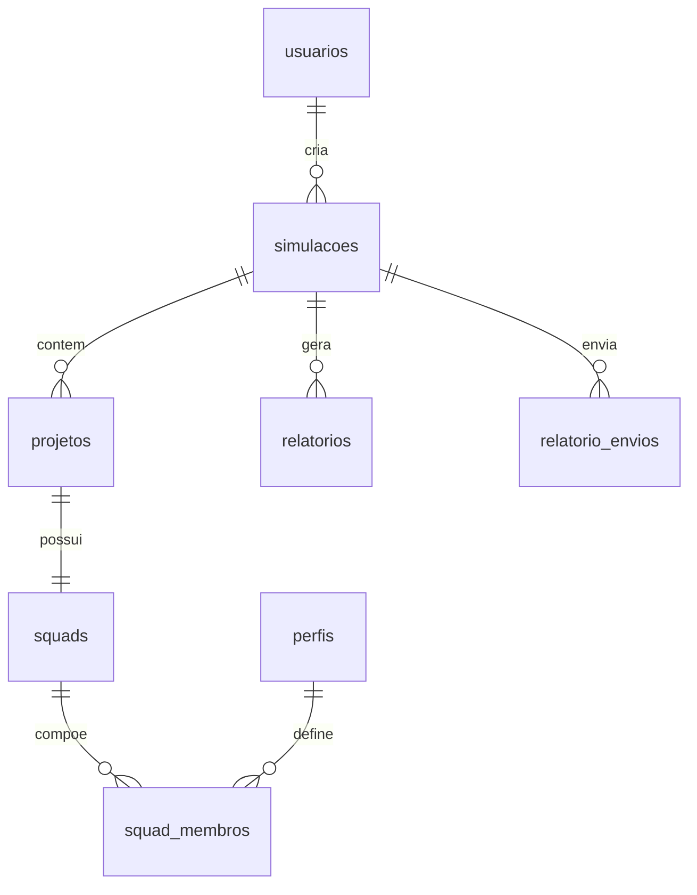

# Banco de Dados — UST Gov

Modelagem PostgreSQL 17 com migrations Flyway.

## Tabelas

| Tabela | Descrição |
|--------|-----------|
| `usuarios` | Usuários (ADMIN, GESTOR, ANALISTA, CONSULTA) |
| `perfis` | Perfis profissionais com FCP |
| `configuracoes` | Parâmetros UST (valor, encargos, BDI) |
| `configuracoes_institucionais` | Nome do órgão e caminho do logo |
| `simulacoes` | Simulações de esforço e custo |
| `projetos` | Projetos, sustentações, evoluções, correções |
| `squads` | Equipes vinculadas a projetos |
| `squad_membros` | Composição da squad por perfil |
| `relatorios` | Metadados de PDF/Excel gerados |
| `relatorio_envios` | Histórico de envio de relatórios por e-mail |

## Migrations Flyway

| Versão | Arquivo | Conteúdo |
|--------|---------|----------|
| V1 | `V1__create_schema.sql` | DDL das 8 tabelas base + constraints |
| V2 | `V2__create_indexes.sql` | Índices de performance |
| V3 | `V3__seed_initial_data.sql` | Admin, analista, perfis, UST |
| V4 | `V4__create_configuracoes_institucionais.sql` | Tabela institucional + seed |
| V5 | `V5__add_gestor_role.sql` | CHECK `role` inclui GESTOR |
| V6 | `V6__create_relatorio_envios.sql` | Histórico de envio por e-mail |
| V7 | `V7__seed_gestor_user.sql` | Usuário gestor de demonstração |

Localização: `backend/src/main/resources/db/migration/`

## `configuracoes_institucionais`

| Coluna | Tipo | Descrição |
|--------|------|-----------|
| id | UUID | PK |
| nome_organizacao | VARCHAR(200) | Nome exibido em relatórios e UI |
| logo_caminho | VARCHAR(500) | Caminho do arquivo no storage |
| created_at, updated_at, created_by, updated_by | | Auditoria |

Arquivo de logo armazenado em `BRANDING_STORAGE_PATH` (padrão: `./storage/branding/logo.{ext}`).

## Convenções

- **PK**: UUID (`gen_random_uuid()`)
- **Auditoria**: `created_at`, `updated_at`, `created_by`, `updated_by`
- **Cascade**: simulações → projetos → squads → squad_membros
- **Snapshot**: `fcp_aplicado` em `squad_membros`

## Dados Iniciais (Seed)

### Usuários (V3 + V7)

| E-mail | Senha | Perfil |
|--------|-------|--------|
| admin@ust.gov.br | admin123 | ADMIN |
| analista@ust.gov.br | analista123 | ANALISTA |
| gestor@ust.gov.br | gestor123 | GESTOR |

> O gestor é criado via migration **V7** no PostgreSQL. No perfil `local` (H2), o `LocalDataSeeder` também garante esse usuário.

### Configuração institucional (V4)

| Campo | Valor padrão |
|-------|----------------|
| nome_organizacao | Governo Federal |

### Configuração UST padrão

| Parâmetro | Valor |
|-----------|-------|
| Valor UST | R$ 180 |
| Carga Horária Mês | 160h |
| Encargos | 75% |
| BDI | 25% |

## Execução

```bash
docker compose -f docker-compose.db.yml up -d
docker exec -it ust-postgres psql -U ust_user -d ust_calculator
```

> O `docker-compose.db.yml` conecta o PostgreSQL à rede `calculadoragov_ust-network` (alias `postgres`) para que o backend Docker continue acessando o banco ao subir apenas o DB.

```sql
SELECT nome_completo, email, role FROM usuarios;
SELECT * FROM configuracoes_institucionais;
SELECT * FROM configuracoes WHERE ativo = TRUE;
```

## Diagrama de Relacionamentos


