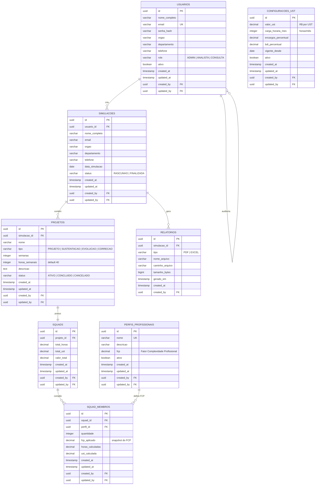

# Modelo Entidade-Relacionamento — UST Gov Calculator

## Diagrama ER



## Descrição das Entidades

### `usuarios`

Armazena os usuários do sistema com seus papéis de acesso.

| Coluna          | Tipo         | Restrições     | Descrição                          |
|-----------------|--------------|----------------|------------------------------------|
| id              | UUID         | PK             | Identificador único                |
| nome_completo   | VARCHAR(200) | NOT NULL       | Nome do usuário                    |
| email           | VARCHAR(150) | NOT NULL, UK   | E-mail de login                    |
| senha_hash      | VARCHAR(255) | NOT NULL       | Senha criptografada (BCrypt)       |
| orgao           | VARCHAR(200) |                | Órgão vinculado                    |
| departamento    | VARCHAR(200) |                | Departamento                       |
| telefone        | VARCHAR(20)  |                | Telefone de contato                |
| role            | VARCHAR(20)  | NOT NULL       | ADMIN, ANALISTA ou CONSULTA          |
| ativo           | BOOLEAN      | DEFAULT true   | Indica se o usuário está ativo     |
| created_at      | TIMESTAMP    | NOT NULL       | Data de criação                    |
| updated_at      | TIMESTAMP    |                | Data da última alteração           |
| created_by      | UUID         | FK → usuarios  | Usuário que criou o registro       |
| updated_by      | UUID         | FK → usuarios  | Usuário que alterou o registro     |

---

### `perfis_profissionais`

Perfis profissionais com Fator de Complexidade Profissional (FCP).

| Coluna      | Tipo          | Restrições   | Descrição                              |
|-------------|---------------|--------------|----------------------------------------|
| id          | UUID          | PK           | Identificador único                    |
| nome        | VARCHAR(100)  | NOT NULL, UK | Ex: Desenvolvedor Junior               |
| descricao   | VARCHAR(500)  |              | Descrição do perfil                    |
| fcp         | DECIMAL(4,2)  | NOT NULL     | Fator de Complexidade (ex: 1.0, 2.8)  |
| ativo       | BOOLEAN       | DEFAULT true | Perfil ativo para novas squads          |
| created_at  | TIMESTAMP     | NOT NULL     |                                        |
| updated_at  | TIMESTAMP     |              |                                        |
| created_by  | UUID          | FK           |                                        |
| updated_by  | UUID          | FK           |                                        |

**Dados iniciais (seed):**

| Perfil                | FCP  |
|-----------------------|------|
| Desenvolvedor Junior  | 1.0  |
| Desenvolvedor Pleno   | 1.3  |
| Desenvolvedor Senior  | 1.8  |
| Especialista          | 2.2  |
| Arquiteto             | 2.5  |
| Scrum Master          | 2.0  |
| Product Owner         | 2.1  |
| Gerente de Projeto    | 2.8  |
| DBA                   | 2.0  |
| DevOps                | 2.2  |
| UX/UI                 | 1.8  |

---

### `configuracoes_ust`

Parâmetros financeiros e de carga horária para cálculo de UST.

| Coluna               | Tipo          | Restrições   | Descrição                    |
|----------------------|---------------|--------------|------------------------------|
| id                   | UUID          | PK           |                              |
| valor_ust            | DECIMAL(10,2) | NOT NULL     | Valor em R$ por UST          |
| carga_horaria_mes    | INTEGER       | NOT NULL     | Horas mensais (padrão: 160)  |
| encargos_percentual  | DECIMAL(5,2)  | NOT NULL     | Encargos % (padrão: 75)      |
| bdi_percentual       | DECIMAL(5,2)  | NOT NULL     | BDI % (padrão: 25)           |
| vigente_desde        | DATE          | NOT NULL     | Data de vigência             |
| ativo                | BOOLEAN       | DEFAULT true | Configuração vigente         |
| created_at           | TIMESTAMP     | NOT NULL     |                              |
| updated_at           | TIMESTAMP     |              |                              |
| created_by           | UUID          | FK           |                              |
| updated_by           | UUID          | FK           |                              |

**Valores padrão:** Valor UST = R$ 180, Carga Horária = 160h, Encargos = 75%, BDI = 25%.

---

### `simulacoes`

Registro de simulações de esforço e custo (Etapa 1 do fluxo).

| Coluna          | Tipo         | Restrições     | Descrição                        |
|-----------------|--------------|----------------|----------------------------------|
| id              | UUID         | PK             |                                  |
| usuario_id      | UUID         | FK, NOT NULL   | Usuário responsável              |
| nome_completo   | VARCHAR(200) | NOT NULL       | Nome do solicitante              |
| email           | VARCHAR(150) | NOT NULL       | E-mail                           |
| orgao           | VARCHAR(200) | NOT NULL       | Órgão                            |
| departamento    | VARCHAR(200) | NOT NULL       | Departamento                     |
| telefone        | VARCHAR(20)  |                | Telefone                         |
| data_simulacao  | DATE         | NOT NULL       | Data da simulação                |
| status          | VARCHAR(20)  | DEFAULT RASCUNHO | RASCUNHO ou FINALIZADA         |
| created_at      | TIMESTAMP    | NOT NULL       |                                  |
| updated_at      | TIMESTAMP    |                |                                  |
| created_by      | UUID         | FK             |                                  |
| updated_by      | UUID         | FK             |                                  |

---

### `projetos`

Projetos, sustentações, evoluções e correções vinculados a uma simulação.

| Coluna          | Tipo         | Restrições     | Descrição                              |
|-----------------|--------------|----------------|----------------------------------------|
| id              | UUID         | PK             |                                        |
| simulacao_id    | UUID         | FK, NOT NULL   | Simulação pai                          |
| nome            | VARCHAR(200) | NOT NULL       | Nome do projeto                        |
| tipo            | VARCHAR(20)  | NOT NULL       | PROJETO, SUSTENTACAO, EVOLUCAO, CORRECAO |
| semanas         | INTEGER      | NOT NULL       | Duração em semanas                     |
| horas_semanais  | INTEGER      | DEFAULT 40     | Horas semanais por profissional        |
| descricao       | TEXT         |                | Descrição detalhada                    |
| status          | VARCHAR(20)  | DEFAULT ATIVO  | ATIVO, CONCLUIDO, CANCELADO            |
| created_at      | TIMESTAMP    | NOT NULL       |                                        |
| updated_at      | TIMESTAMP    |                |                                        |
| created_by      | UUID         | FK             |                                        |
| updated_by      | UUID         | FK             |                                        |

---

### `squads`

Composição de equipe vinculada a um projeto, com totais calculados.

| Coluna       | Tipo          | Restrições     | Descrição                         |
|--------------|---------------|----------------|-----------------------------------|
| id           | UUID          | PK             |                                   |
| projeto_id   | UUID          | FK, NOT NULL, UK | Um squad por projeto            |
| total_horas  | DECIMAL(12,2) |                | Soma de horas de todos os membros |
| total_ust    | DECIMAL(12,2) |                | Soma de UST calculada             |
| valor_total  | DECIMAL(14,2) |                | Valor financeiro total            |
| created_at   | TIMESTAMP     | NOT NULL       |                                   |
| updated_at   | TIMESTAMP     |                |                                   |
| created_by   | UUID          | FK             |                                   |
| updated_by   | UUID          | FK             |                                   |

---

### `squad_membros`

Membros individuais da squad com quantidade por perfil.

| Coluna            | Tipo          | Restrições     | Descrição                              |
|-------------------|---------------|----------------|----------------------------------------|
| id                | UUID          | PK             |                                        |
| squad_id          | UUID          | FK, NOT NULL   | Squad pai                              |
| perfil_id         | UUID          | FK, NOT NULL   | Perfil profissional                    |
| quantidade        | INTEGER       | NOT NULL       | Quantidade de profissionais            |
| fcp_aplicado      | DECIMAL(4,2)  | NOT NULL       | Snapshot do FCP no momento do cálculo  |
| horas_calculadas  | DECIMAL(12,2) |                | Qtd × Horas Semanais × Semanas         |
| ust_calculada     | DECIMAL(12,2) |                | Horas × FCP                              |
| created_at        | TIMESTAMP     | NOT NULL       |                                        |
| updated_at        | TIMESTAMP     |                |                                        |
| created_by        | UUID          | FK             |                                        |
| updated_by        | UUID          | FK             |                                        |

**Constraint:** `UNIQUE(squad_id, perfil_id)` — um perfil por squad.

---

### `relatorios`

Relatórios gerados (PDF executivo e Excel técnico).

| Coluna          | Tipo         | Restrições     | Descrição                    |
|-----------------|--------------|----------------|------------------------------|
| id              | UUID         | PK             |                              |
| simulacao_id    | UUID         | FK, NOT NULL   | Simulação referenciada       |
| tipo            | VARCHAR(10)  | NOT NULL       | PDF ou EXCEL                 |
| nome_arquivo    | VARCHAR(255) | NOT NULL       | Nome do arquivo gerado       |
| caminho_arquivo | VARCHAR(500) | NOT NULL       | Caminho de armazenamento     |
| tamanho_bytes   | BIGINT       |                | Tamanho do arquivo           |
| gerado_em       | TIMESTAMP    | NOT NULL       | Data/hora da geração         |
| created_at      | TIMESTAMP    | NOT NULL       |                              |
| created_by      | UUID         | FK             | Usuário que gerou            |

---

### `relatorio_envios`

Histórico de envio de relatórios por e-mail (auditoria no backend).

| Coluna          | Tipo         | Restrições     | Descrição                    |
|-----------------|--------------|----------------|------------------------------|
| id              | UUID         | PK             |                              |
| simulacao_id    | UUID         | FK, NOT NULL   | Simulação referenciada       |
| relatorio_id    | UUID         | FK             | Arquivo gerado (opcional)    |
| destinatario    | VARCHAR(150) | NOT NULL       | E-mail do destinatário       |
| assunto         | VARCHAR(200) | NOT NULL       | Assunto do e-mail            |
| tipo            | VARCHAR(10)  | NOT NULL       | PDF ou EXCEL                 |
| status          | VARCHAR(20)  | NOT NULL       | ENVIADO ou FALHA             |
| mensagem_erro   | TEXT         |                | Detalhe em caso de falha     |
| enviado_em      | TIMESTAMP    | NOT NULL       | Data/hora do envio           |
| created_at      | TIMESTAMP    | NOT NULL       |                              |
| created_by      | UUID         | FK             | Usuário que enviou           |

## Índices Recomendados

```sql
CREATE INDEX idx_simulacoes_usuario_id ON simulacoes(usuario_id);
CREATE INDEX idx_simulacoes_data ON simulacoes(data_simulacao);
CREATE INDEX idx_projetos_simulacao_id ON projetos(simulacao_id);
CREATE INDEX idx_projetos_tipo ON projetos(tipo);
CREATE INDEX idx_squads_projeto_id ON squads(projeto_id);
CREATE INDEX idx_squad_membros_squad_id ON squad_membros(squad_id);
CREATE INDEX idx_squad_membros_perfil_id ON squad_membros(perfil_id);
CREATE INDEX idx_relatorios_simulacao_id ON relatorios(simulacao_id);
CREATE INDEX idx_relatorio_envios_simulacao_id ON relatorio_envios(simulacao_id);
CREATE INDEX idx_usuarios_email ON usuarios(email);
CREATE INDEX idx_configuracoes_ativo ON configuracoes_ust(ativo) WHERE ativo = true;
```

## Regras de Integridade

1. Exclusão de simulação em cascata: projetos → squads → squad_membros
2. Apenas uma configuração UST ativa por vez
3. FCP é snapshot em `squad_membros` para preservar histórico
4. Totais em `squads` são recalculados a cada alteração de membros
5. Usuário CONSULTA tem acesso somente leitura em todas as entidades
